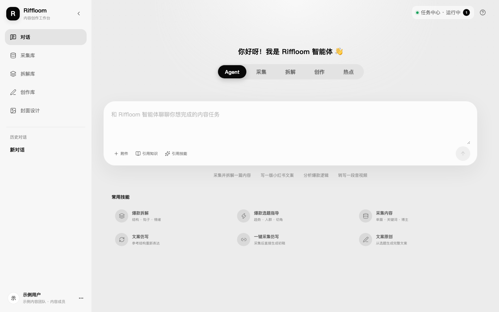
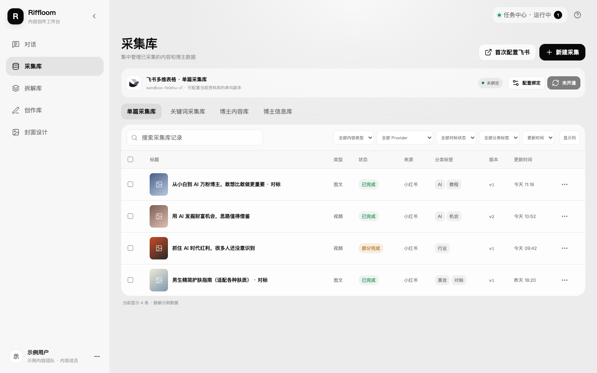
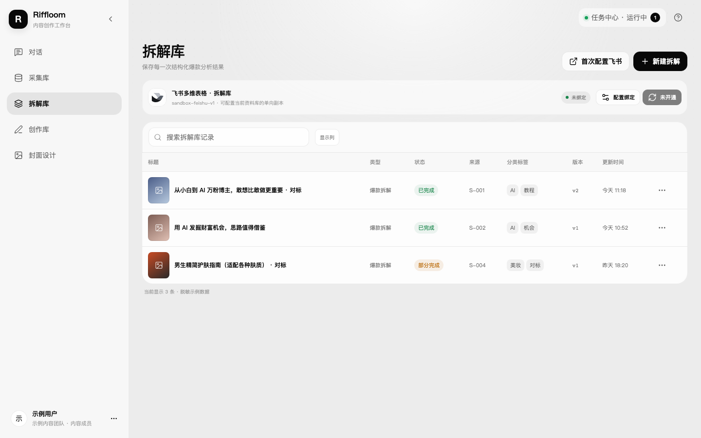
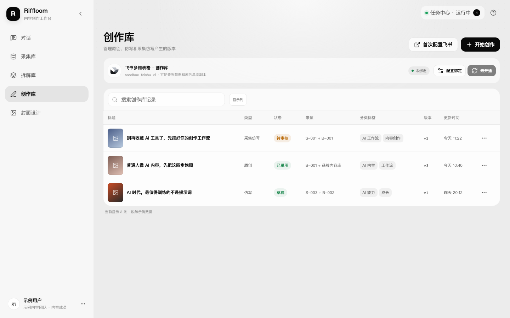
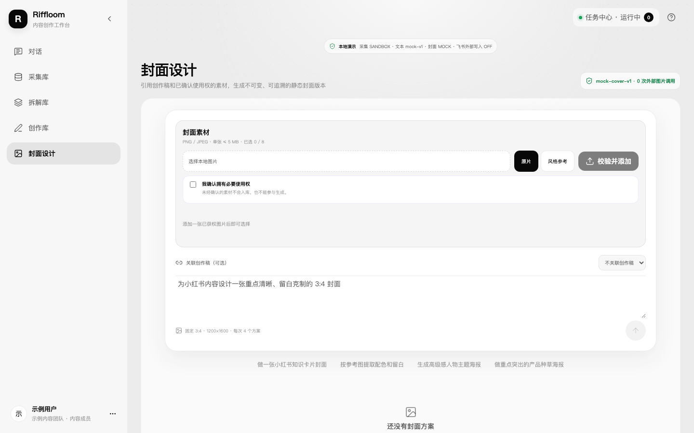
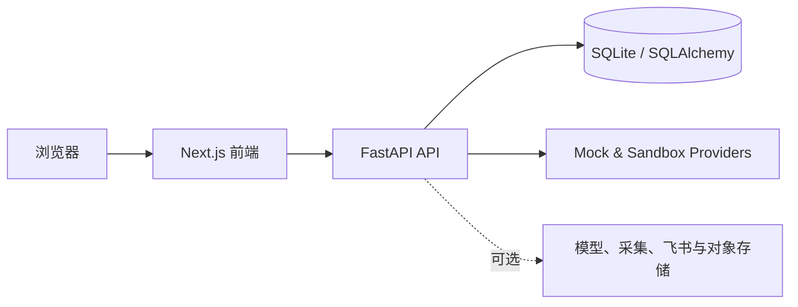

<div align="center">

# Riffloom

**面向内容团队的 AI 采集、拆解与创作工作台**

*An open-source AI workspace for collecting, analyzing and creating content.*

[快速开始](#快速开始) · [功能](#功能) · [使用说明](docs/user-guide.md) · [配置说明](docs/configuration.md)

</div>

Riffloom 把素材采集、内容拆解、创作、封面设计和对话式工作流放进同一个工作台。项目默认使用本地 SQLite、模拟模型和沙盒数据源，不配置任何密钥也可以运行和体验完整界面。

> 本仓库不包含生产环境配置、真实用户数据、内部项目文档或原始开发历史。第三方服务均需由部署者自行申请、配置并遵守对应平台规则。

## 功能

- **对话式工作台**：通过 Agent 或采集、拆解、创作、热点 Tab 发起任务，支持多技能与知识库引用。
- **采集库**：管理单篇内容、关键词采集、博主内容和博主信息。
- **拆解库**：沉淀结构、钩子、情绪、受众与可复用洞察。
- **创作库**：保留创作版本、来源关系和采用状态。
- **封面设计**：使用模拟 Provider 体验封面方案流，按需接入真实图像服务。
- **任务与历史**：任务中心展示异步进度，对话历史可恢复、重命名和删除。
- **可选集成**：代码包含 TikHub、DeepSeek、火山方舟和飞书适配器；默认全部关闭或运行在 sandbox/mock 模式。

## 界面预览

| 对话工作台 | 采集库 |
| --- | --- |
|  |  |

| 拆解库 | 创作库 |
| --- | --- |
|  |  |



## 快速开始

要求：Python 3.11+、Node.js 22.22.2+、npm。

```bash
git clone https://github.com/betterjally-oss/riffloom.git
cd riffloom
./scripts/setup.sh
./scripts/dev.sh
```

打开 <http://127.0.0.1:3100>。后端 API 文档位于 <http://127.0.0.1:8100/docs>。

默认配置不访问真实第三方服务。需要自定义端口、数据库或 Provider 时，请参阅[安装说明](docs/installation.md)与[配置说明](docs/configuration.md)。

## 架构



目录结构：

```text
riffloom/
├── frontend/   # Next.js 16 + React 19
├── backend/    # FastAPI + SQLAlchemy + Alembic
├── docs/       # 安装、使用与配置说明
└── scripts/    # 本地安装、启动与检查脚本
```

## 测试

```bash
./scripts/check.sh
```

该命令运行后端 pytest，以及前端 lint、类型检查和 Vitest。端到端测试可在安装 Chrome 后单独运行：

```bash
cd frontend
npx playwright install chromium
npx playwright test
```

## 安全与隐私

- 不要提交 `.env`、访问令牌、邀请码、用户数据或数据库文件。
- `NEXT_PUBLIC_*` 会进入浏览器代码，不能存放秘密。
- 真实采集、飞书写入、模型和图片生成可能产生费用或涉及平台授权，启用前请先阅读[配置说明](docs/configuration.md)。
- 安全问题请按 [SECURITY.md](SECURITY.md) 私下报告，不要在公开 Issue 中披露凭据或漏洞细节。

## 参与贡献

欢迎提交 Issue 和 Pull Request。开始前请阅读 [CONTRIBUTING.md](CONTRIBUTING.md)。

## 许可证

本项目以 [GNU Affero General Public License v3.0](LICENSE) 发布。通过网络向用户提供修改后的版本时，请同时向这些用户提供对应源代码。
